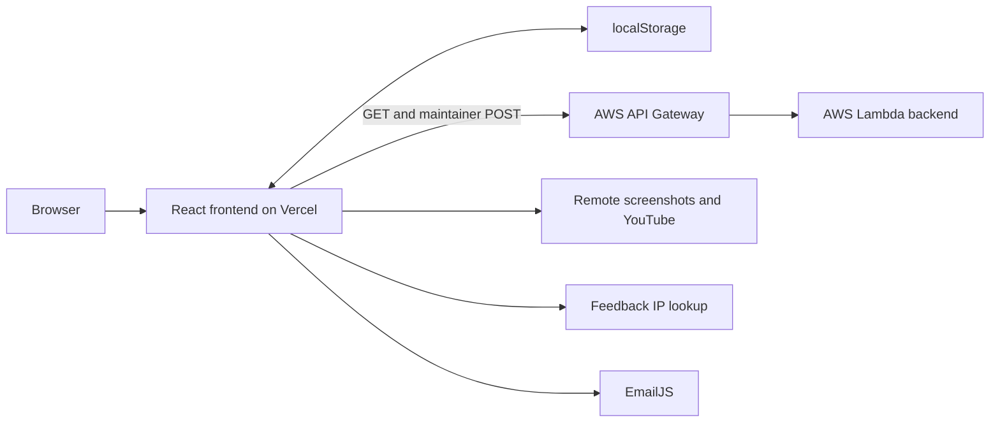
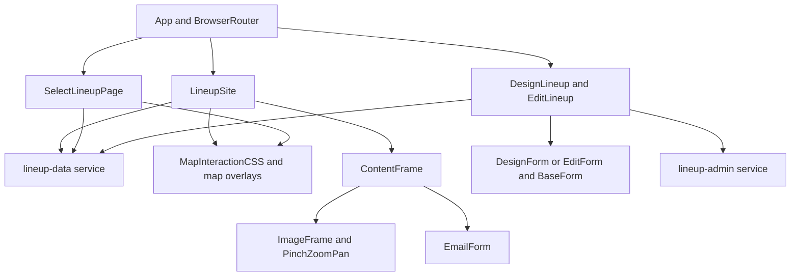

# Architecture and invariants

This is the implementation map for agents changing the frontend. Start with [AGENTS.md](../AGENTS.md), use [DEVELOPMENT.md](DEVELOPMENT.md) for edit recipes, and use [TESTING.md](TESTING.md) to select verification. This document describes the current code, including its limitations; it is not a proposed redesign.

## System boundary and sources of truth

The application is a browser-only React single-page app. The user confirms that the frontend is hosted on **Vercel** and the backend runs on **AWS Lambda**. The frontend source shows an AWS API Gateway URL in [`API_URL`](../src/component-utils/constants.ts). The Vercel project settings, Lambda function implementation, API Gateway configuration, and backend repository are not present here. Do not infer their settings from this frontend.



Source/configuration boundaries:

| Concern | Source of truth | Agent constraint |
| --- | --- | --- |
| Routes and page composition | [`src/App.tsx`](../src/App.tsx) | Keep `/` and `/:lineupId` on the same viewer implementation. |
| IDs, catalogs, imported map/ability assets, API URL, cache duration | [`constants.ts`](../src/component-utils/constants.ts) | Display order is independent of permanent numeric IDs. |
| Wire records and form values | [`types/lineup.ts`](../src/types/lineup.ts) | Persist numeric IDs; UI selects use objects. |
| Runtime validation/cache/filter/cluster behavior | [`lineup-data.ts`](../src/services/lineup-data.ts) | Both viewer and selector call this module. |
| Validation and API mutation construction | [`lineup-admin.ts`](../src/services/lineup-admin.ts) | Preserve operation-to-payload correlation. |
| Layout and marker dimensions | [`scss`](../src/scss/main.scss), particularly [`_map.scss`](../src/scss/lineupSite/_map.scss) | Coordinate contracts depend on these selectors and dimensions. |
| Hosting/backend integration | [DEPLOYMENT.md](DEPLOYMENT.md), [API_REFERENCE.md](API_REFERENCE.md) | External settings need evidence from their own systems. |

There is no SSR, global application-state store, service worker registration, or query library. `IconContext.Provider` is used for icon styling; it is not a shared data store. Pages own their data in typed React class state, while smaller components generally use functions and hooks.

## Entry points and module responsibilities

[`index.tsx`](../src/index.tsx) requires a DOM element with ID `root`, imports the checked-in compiled CSS, and mounts `App` with `ReactDOM.createRoot` inside `React.StrictMode`. A missing root throws an explicit startup error.

| Module/symbol | Owns | Delegates to / important coupling |
| --- | --- | --- |
| [`App`](../src/App.tsx) | `BrowserRouter`, route table, global `Navbar` | No page data fetching. |
| [`Navbar`](../src/component-utils/navbar/Navbar.tsx) / [`SidebarData`](../src/component-utils/navbar/SidebarData.tsx) | Open/closed state, focus, Escape, visible navigation entries | Uses route location to close on pathname changes. Hidden menu controls leave the tab order. |
| [`LineupSite`](../src/pages/LineupSite.tsx) | Viewer load state, filters, selected record, clusters/arrows, rotation, marker scale | Shared data helpers; router props; `ContentFrame`. |
| [`SelectLineupPage`](../src/pages/SelectLineupPage.tsx) | Maintainer browsing and selection | Shared data helpers; writes `editMarker`; opens `/edit`. |
| [`DesignLineup`](../src/pages/DesignLineup.tsx) | Create draft, map placement mode, submission lifecycle | `DesignForm` and admin service. |
| [`EditLineup`](../src/pages/EditLineup.tsx) | Loaded record, edited draft, original/current record identity, mutation lifecycle | `EditForm`, storage helpers, admin service. |
| [`BaseForm`](../src/component-utils/design-utils/BaseForm.tsx) | Controlled field rendering; image-tag add/delete transformations | Receives `state` and `updateState`; does not send requests. |
| [`ContentFrame`](../src/component-utils/lineup-site-utils/ContentFrame.tsx) | Detail presentation, feedback popup state, clipboard and hide-preference effects | Parent owns selected content and hidden IDs. |
| [`MapInteractionCSS`](../src/component-utils/map-utils/MapInteractionCSS.tsx) | CSS application of map-library transforms; marker-scale callback | Forwards interaction props to `react-map-interaction`. |
| [`PinchZoomPan`](../src/component-utils/responsive-pinch-zoom-pan/PinchZoomPan.tsx) | Screenshot gesture state, measurements, constraints, animation/listeners | Local implementation; independent of map-library state. |
| [`Info`](../src/pages/Info.tsx) | About content and reset of app-owned local-storage keys | Does not wipe unrelated origin storage. |



## Routing and state ownership

| Route | Component | Entry behavior |
| --- | --- | --- |
| `/` | `LineupSite` | Viewer; initially Ascent (map ID `1`) and Sova (agent ID `13`), with catalog-first fallbacks. |
| `/:lineupId` | `LineupSite` | Same viewer; resolves a record from the loaded list. |
| `/about` | `Info` | Information and local data reset. |
| `/send` | `DesignLineup` | Empty create draft; map defaults to `MAP_LIST[0]`. |
| `/select` | `SelectLineupPage` | Maintainer selector; `MAP_LIST[0]`, Sova, all abilities. |
| `/edit` | `EditLineup` | Loads the record snapshot in `localStorage.editMarker`. |

The current first catalog map is Abyss. The viewer deliberately looks up Ascent by ID instead. Only `/` and `/about` appear in `SidebarData`. Static paths such as `/about` are reserved by the route table; there is no dedicated catch-all/404 page. A single unknown path segment reaches the viewer as a lineup ID.

[`withRouter<Props extends RouterProps>`](../src/component-utils/withRouter.tsx) is the bridge between Router hooks and the viewer class. Its functional wrapper calls `useNavigate` and `useParams`; its public type is `ComponentType<Omit<Props, keyof RouterProps>>`. Callers of the wrapped viewer do not supply the injected props. Tests can import the named class when direct prop injection is useful, or the default wrapped export inside a router for integration behavior.

### Viewer lifecycle

`LineupSite` keeps these state groups together:

- **Load/data:** `loading`, `error`, grouped `savedLineups`, flat `allLineups`.
- **Filters:** `map`, nullable `agent`/`ability`, selected `filters`, `hiddenMarkers`.
- **Selection/content:** `activeMarkerId`, name/description/tags/credits/video/images.
- **Map presentation:** `enabledMarkers`, `clusters`, `selectedCluster`, `mapArrows`, `mapRotation`, `markerScale`, `defaultMapValue`.

The lifecycle is intentional:

1. `componentDidMount` increments `loadRequest`, sets the title, reads hidden IDs, and awaits `loadLineups`.
2. Only the currently active request generation may update state. `componentWillUnmount` increments the generation, making an earlier completion obsolete.
3. Successful load stores both representations and calls `syncSelectionWithUrl` in the state callback.
4. `componentDidUpdate` calls `syncSelectionWithUrl` when `params.lineupId` changes. Browser back/forward therefore uses router props rather than a global `onpopstate` handler.
5. `updateMap` applies filters, clusters the surviving records, and finds the cluster containing `activeMarkerId`. Keeping that selected cluster preserves start-marker choices for a selected member of a multi-record cluster.

The generation guard suppresses obsolete **UI writes**. It does not abort the underlying GET, deduplicate requests, or prevent the service from writing a completed response to its cache. StrictMode can therefore produce duplicate read requests in development.

`syncSelectionWithUrl` has three notable cases:

- No ID or an unknown ID clears the detail/arrow selection and rebuilds the map without another fetch. An unknown ID is not presented as a dedicated “not found” error.
- A known record sets its map and agent. If it is already enabled, existing ability/tag filters are preserved; otherwise those filters reset. Hidden IDs remain hidden, so a direct link can show details for a record whose marker is excluded.
- An unsupported map or agent produces an error. Unknown abilities are skipped by marker rendering; the record validator itself does not enforce catalog membership.

Changing maps navigates to `/`, clears details and pinned overlays, resets tag filters, and rebuilds markers immediately. It does not wait for an image `load` event. Agent changes reset ability selection; filter changes rebuild marker visibility but do not inherently clear the detail record.

### Viewer versus maintainer selector

The selector shares loading, cache validation, filtering, clustering, and marker rendering concepts, but has no detail panel or URL-selected record. Its `updateMap` clears `selectedCluster` on each filter refresh. A chosen record goes through `writeStorageItem("editMarker", ...)`; only a successful write is followed by `window.open("/edit", "_blank", "noopener,noreferrer")`. Storage failure is visible and prevents opening an unusable editor.

`editMarker` is a single shared slot for the origin. `/edit` reads it on mount, not continuously. The editor's `saveSelection` checks the saved record ID before overwriting/removing that slot, avoiding replacement of another tab's different selection. It is not backend concurrency control, and there is no `storage` event synchronization between open pages.

## Load, cache, and external-data boundary

The full field/ID contract is in [LINEUP_DATA.md](LINEUP_DATA.md); exact HTTP and helper contracts are in [API_REFERENCE.md](API_REFERENCE.md).

```mermaid
sequenceDiagram
    participant Page as Viewer or selector
    participant Data as loadLineups
    participant Storage as Optional localStorage
    participant API as API Gateway
    Page->>Data: expirationMs
    Data->>Storage: Read savedLineups and lastRetrievedTime
    alt Cache passes timestamp and record validation
        Data-->>Page: all, byMap, source=cache
    else Missing, expired, denied, or invalid cache
        Data->>API: GET API_URL
        API-->>Data: JSON response
        Data->>Data: Check response.ok and isLineupArray
        Data->>Storage: Write grouped records if possible
        opt Dataset write succeeds
            Data->>Storage: Write timestamp
        end
        Data-->>Page: all, byMap, source=network
    end
    Page->>Page: Ignore obsolete generation; otherwise select/filter
```

In memory, `LineupsByMap` is `Partial<Record<number, LineupRecord[]>>`; missing buckets are normal and consumers use `?? []`. In storage, JSON object keys are strings:

```text
savedLineups       = JSON.stringify({ "1": [recordA, recordB], "11": [recordC] })
lastRetrievedTime = String(epochMilliseconds)
hiddenMarkers     = JSON.stringify(["lineup-id-a", "lineup-id-b"])
editMarker        = JSON.stringify(oneCompleteLineupRecord)
```

`recordA`/`recordB`/`recordC` above stand for complete records, not abbreviated objects accepted by the parser. `parseLineupCache` rejects blank/nonfinite/negative/future timestamps, expired data, nonpositive expiration intervals, non-object JSON, noncanonical positive integer map keys, malformed records, and records stored under a different map ID. The configured duration is ten days; expiry is checked when loading, not on a background timer.

Storage is optional for read-only viewing. `getBrowserStorage`, `readStorageItem`, `writeStorageItem`, and `removeStorageItem` catch access/quota failures. A successful network response still renders if cache persistence fails. The timestamp is only updated after the replacement dataset was written, so a failed dataset write cannot make old records look fresh.

The API record guard checks required string/array fields and finite numbers. It does not verify remote image availability, every coordinate's allowed authoring range, catalog membership, unique record IDs, or authorization. TypeScript types do not replace this runtime boundary.

A load failure ends the loading state and displays the error over the map. There is no automatic retry, stale-cache-on-error fallback, incremental fetch, pagination, or background refresh. Successful maintainer mutations remove the cache keys for the **next** load; already mounted viewers keep their in-memory data until reloaded.

## Filtering, clustering, and overlays

`filterLineups` takes the current map bucket and applies exact agent matching, optional ability matching, hidden-ID exclusion, and **all-selected-tags** matching. It creates a `Set` for hidden IDs and sorts the result by `x`. `abilityId: null` means all abilities for the chosen agent.

`clusterLineups` also copies and sorts its own input by `x`, so callers do not need to pre-sort and their arrays are not mutated. Its radius defaults to `CLUSTER_RADIUS = 15`:

1. Construct one cluster per target coordinate, retaining the record ID and start position.
2. For each current cluster, scan subsequent candidates while their X separation is below the radius.
3. Require equal **agent and ability** IDs, then require Euclidean distance strictly less than the radius.
4. Merge candidate points into the current cluster, replace its center with the midpoint of the two centers, remove the candidate, and continue scanning.

Example: same-agent/same-ability targets `(0, 0)`, `(10, 0)`, `(12, 0)` become `(5, 0)` after the first merge and `(8.5, 0)` after the second. Their arithmetic centroid would be about `(7.33, 0)`. This is a greedy pairwise-midpoint algorithm, not a weighted centroid or a general connected-components clustering algorithm. Input order among tied X coordinates can affect results; centers move during merging and clusters are not globally reclustered until the next call. Points exactly 15 pixels apart do not merge at the default radius.

`arrowsForCluster` adds `MARKER_CENTER_OFFSET = 13` to the target center and each retained start coordinate. Pages render one SVG with one line per arrow. Hover temporarily adds arrows; leaving restores pinned arrows. A single-record cluster selects immediately. A multi-record cluster pins its arrows and renders a `StartMarker` for each member; clicking one resolves the record.

Cost grows with the current map's records. Filtering scans selected tags against each record's tag array and sorts the result. Clustering sorts again and can require quadratic comparisons/array shifting in dense data. Each filter/selection refresh allocates derived arrays; every arrow is a separate SVG element. There is no spatial index or viewport virtualization. Profile those paths before attempting broad page refactors for a substantially larger dataset.

## Coordinate contract and map transform

All checked-in minimaps and overlay frames use a **1000 × 1000** logical space. Coordinate persistence is independent of zoom and rotation. The relevant implementation spans [`DesignLineup.onMapClick`](../src/pages/DesignLineup.tsx), [`EditLineup.onMapClick`](../src/pages/EditLineup.tsx), [`Marker`](../src/component-utils/map-utils/Marker.tsx), [`StartMarker`](../src/component-utils/map-utils/StartMarker.tsx), and [`_map.scss`](../src/scss/lineupSite/_map.scss).

| Value | Meaning |
| --- | --- |
| `x`, `y` | Top-left coordinate of a target marker before transforms. |
| `startX`, `startY` | Top-left coordinate of a start marker before transforms. |
| Marker dimensions | 25 × 25 CSS pixels in unscaled map space. |
| Authoring click conversion | `nativeEvent.offsetX - 12.5`, `nativeEvent.offsetY - 12.5`. |
| Unset draft position | Both coordinates are `-1`; submission rejects unset/out-of-range positions. |
| Arrow endpoints | Marker/cluster position plus `13`, approximately the icon center. |

A click at map-local `(212.5, 312.5)` stores `(200, 300)`. The authoring click handler accepts the **adjusted top-left** only in `[0, 1000]`; clicks in the first 12.5 pixels at the top or left are consequently rejected. Changing this convention requires coordinated marker, click-handler, validator, and existing-record consideration.

`MapInteractionCSS` emits this CSS, with transform origin `0 0`:

```css
transform: translate(tx, ty) scale(s);
```

For a point relative to that transform origin, the resulting coordinate is `(tx + s*x, ty + s*y)`. Example: `(100, 200)` with scale `2` and translation `(10, 20)` becomes `(210, 420)`. This excludes the page's layout offsets, including the map element's margin. Translation is not multiplied by scale.

Viewer/selector rotation is `0`, `90`, `180`, or `270` degrees. The map image, 1000-pixel marker frame, and 1000-pixel SVG layers rotate together around their centers. In screen coordinates, a 90-degree clockwise rotation maps a logical point `(x, y)` to `(1000-y, x)`; `(250, 400)` becomes `(600, 250)`. Marker images counter-rotate by the negative angle to stay upright.

The wrapper reports `s ** 0.8` through `updateScale` in an effect after render. Pages update `markerScale` only when it changes. Each marker applies `min(1, 1 / markerScale)`, so above scale 1 the final icon-size factor is approximately `s ** 0.2`; at scale 4 a 25-pixel icon becomes about 33 pixels, not 100. Below scale 1 the icon shrinks with the map. Authoring pages supply a no-op scale callback and let their markers grow with the map.

## Two separate zoom systems

Do not interchange these components without accounting for their contracts.

| Concern | MapInteractionCSS | PinchZoomPan |
| --- | --- | --- |
| Used for | Minimap plus overlay layers on four map pages | Individual detail screenshots via `ImageFrame` |
| State owner | `react-map-interaction`, normally uncontrolled here | Local typed class state |
| Children | Arbitrary `ReactNode` | Exactly one element with an `HTMLElement` ref |
| Transform | `translation: {x,y}` and `scale` | `top`, `left`, `scale`, image/container dimensions |
| Rotation | Page composes it into child layers | No rotation API |
| Size constraints | Library scale/optional translation bounds | Measured image/container bounds and optional transient overzoom |
| Parent callback | Required `updateScale` for markers | No public transform-change callback |

### Map wrapper API and callers

The app's supported map-library surface is explicitly declared in [`types/react-map-interaction.d.ts`](../src/types/react-map-interaction.d.ts): `value`, `defaultValue`, `onChange`, `minScale`, `maxScale`, `disableZoom`, `disablePan`, and `translationBounds`. The wrapper replaces the library's render-function children with ordinary content. It does not expose every upstream feature; extend the declaration only after checking the installed library.

| Caller | Initial transform | Scale bounds |
| --- | --- | --- |
| Viewer and selector | `0.85`, translation `{x:0, y:10}` | `0.5` to `16` |
| Creator | Library default | Library minimum; maximum `6` |
| Editor | `0.85`, translation `{x:0, y:0}` | Library minimum; maximum `10` |

The locked `react-map-interaction` implementation defaults to scale 1 and zero translation, a minimum of `0.05`, maximum `3`, and no translation bounds. Current callers override the maximums listed above. `defaultValue` is initialization, not a controlled reset mechanism. For a future externally controlled transform, use `value` with `onChange` instead. The wrapper clips overflow and disables native touch actions in its viewport.

### Screenshot pinch/zoom API

The local class has `defaultProps`, so these defaulted props can be omitted in JSX even though the resolved class prop interface lists them as required:

| Prop | Default | Contract |
| --- | --- | --- |
| `children` | None | Exactly one zoomable DOM-backed element. |
| `initialScale` | `"auto"` | Number or automatic fit. |
| `minScale` | `"auto"` | Number or automatic fit. |
| `maxScale` | `1` | Maximum scale. |
| `position` | `"topLeft"` | `"topLeft"` or `"center"`. |
| `zoomButtons` | `true` | Render accessible plus/minus controls after initialization. |
| `doubleTapBehavior` | `"reset"` | `"reset"` or `"zoom"`. |
| `initialTop`, `initialLeft` | Unspecified, effectively 0 for top-left | Ignored with a warning for centered positioning. |
| `debug` | Unspecified/false | Render transform/overflow diagnostics and console messages. |

`"auto"` uses `min(containerWidth/imageWidth, containerHeight/imageHeight, 1)`; it does not enlarge a small image above scale 1. The component waits for positive measurable dimensions. An image is ready after `load` or when a cached image is complete with positive `naturalWidth`. Non-image DOM children do not wait for an image event.

Provide positive finite scale settings with `minScale <= initialScale <= maxScale` after resolving automatic values. Invalid ordering warns and skips the initial transform; the component is not a general runtime validator for arbitrary prop values. Normal panning is clamped to the image overflow. A smaller centered image has no overflow. Two-finger gestures allow 5% transient scale/pan tolerance and animate back after release.

Wheel zoom changes scale by factors of `1.1` or `0.9`; button zoom uses the container center. Pinch calculations convert the midpoint from viewport to container coordinates so the touched point remains anchored even when the image is offset on the page. Double taps within 250 ms, or mouse double-clicks, reset or zoom according to the prop; moved touch gestures are not counted as taps. Animated movement uses `requestAnimationFrame` with a 0.1 approach factor and snaps near the target.

Lifecycle constraints for edits:

- The component measures on mount, image load, window resize, and component updates. There is no `ResizeObserver` for a container-only layout change without one of those triggers.
- Changes to initial position/scale props reapply the initial transform; changes to bounds constrain the current transform.
- It merges child styles, but its own cursor/transform/origin win. It forwards the child `onLoad` and ref; the gesture, wheel, drag, and context-menu handlers installed by cloning replace same-named child handlers rather than composing them.
- Native `touchmove` uses `{passive:false}`. Ref changes and unmount remove listeners/cancel animation; mount registers the listener again so StrictMode lifecycle remounts remain functional.
- [`ImageFrame`](../src/component-utils/lineup-site-utils/ImageFrame.tsx) uses `key={image}`, guaranteeing a fresh gesture instance for a changed screenshot URL. It passes initial/min scale `1`, maximum `15`, centered positioning, zoom-on-double-tap, and no buttons.
- `ImageFrame` prevents wheel scrolling only on its own frame, with effect cleanup. It does not install a global scroll lock.

The utility calculations are in [`Utils.ts`](../src/component-utils/responsive-pinch-zoom-pan/Utils.ts); interaction regressions belong beside the class in [`PinchZoomPan.test.tsx`](../src/component-utils/responsive-pinch-zoom-pan/PinchZoomPan.test.tsx).

## Forms, mutations, and async behavior

`LineupFormValues` stores select objects, image-tag objects, draft coordinates, status text, and a runtime API key. It is deliberately different from `LineupRecord`. `BaseForm` receives controlled state and emits `Partial<LineupFormValues>` updates. `DesignForm` supplies its submit button; `EditForm` adds update/delete actions and a local delete-confirmation flag.

Pages own placement flags and submission lifecycles. Selecting another map clears both positions. During a request, a synchronous `requestInFlight` flag prevents duplicate submissions and state edits; `isSubmitting` disables visible controls. The service validates/builds/sends; pages handle success/error display, draft resets, cache invalidation, and persistence. Disposed pages avoid late React state writes, but a submitted backend request is not canceled merely by navigation.

`lineup-admin.ts` separates:

1. `validateLineupForm` and the shared `normalizeYouTubeVideo` helper.
2. `buildAddPayload`, `buildEditPayload`, and `buildDeletePayload`.
3. Typed request creation and `sendLineupMutation` with injectable `fetcher`/URL.

The request API uses a mapped union of tuples so `"delete"`, `"edit"`, and `"add"` remain correlated with their payload shapes. Do not widen the public signature to an unrelated operation union plus payload union. Delete uses the loaded record's map ID, and a successful move updates that record before a subsequent delete. Exact validation rules, response semantics, and maintainer steps are maintained in [API_REFERENCE.md](API_REFERENCE.md) and [MAINTAINER_GUIDE.md](MAINTAINER_GUIDE.md).

## Detail media and feedback

`ContentFrame` renders parent-owned content and owns only its popup state. `TagList` resolves IDs and puts the first difficulty tag first and the first attacking/defending tag second, ahead of remaining tags, without mutating the input. Unknown tag IDs are omitted by the catalog helper.

Clipboard writes use an encoded ID on the fixed production domain `https://valorant-lineups.com`, including during localhost development. Success appears only after the write resolves; rejection/unavailable clipboard produces an error. Hiding a lineup creates a new list and updates the parent before persistence; a denied storage write leaves the change active for that visit and reports the failure. HTTP(S) credit values become external links; other values stay text. YouTube embeds use shared [video normalization](LINEUP_DATA.md#form-normalization) to retain playback start times and support existing bare IDs. Screenshot and video availability is external; there is no media retry, image upload, or lazy-loading layer here.

`EmailForm` performs its IP lookup when the feedback form mounts, using an `AbortController`. A failed lookup leaves the IP empty and does not block sending. Submitting trims fields, rejects whitespace-only name/message, disables repeated sends, and invokes EmailJS. Success leaves the button disabled and schedules popup closure after three seconds; failure re-enables retry. Cleanup aborts the lookup, clears the close timer, and suppresses late state changes. It cannot cancel an EmailJS send already submitted. Service/template/public-key identifiers are compiled into this component; security and external-configuration ownership are detailed in [SECURITY.md](SECURITY.md).

## Maintenance limits and change boundaries

- Viewer and selector share algorithms but retain similar page/interaction code. Change both callers when a shared behavior is implemented in a page rather than a service.
- Cache data, map/agent catalogs, and remote content can evolve independently. Runtime schema validity does not imply catalog compatibility or that a screenshot still loads.
- Fixed map dimensions, global CSS selectors, full-viewport layout, and hidden body overflow constrain responsive work. See the selector coupling in [DEVELOPMENT.md](DEVELOPMENT.md).
- Class state stores derived arrays and copied detail fields. Update through the existing callbacks; mutating a stored record or cluster in place can leave derived displays stale.
- There is no offline app shell, backend authentication implementation, server-side validation code, cross-tab live refresh, or production monitoring implementation in this repository.
- Historical [`lineups.json`](../src/resources/Lineups/lineups.json) and [`sampleLineup.json`](../src/resources/sampleLineup.json) are not imported as runtime data. Editing them does not populate the viewer.
- Dependency/toolchain risks and previous verification evidence are recorded in [REVIEW.md](REVIEW.md) and [SECURITY.md](SECURITY.md). Passing jsdom tests does not establish real-browser touch, visual layout, clipboard permission, media, or hosting behavior; follow [TESTING.md](TESTING.md).
