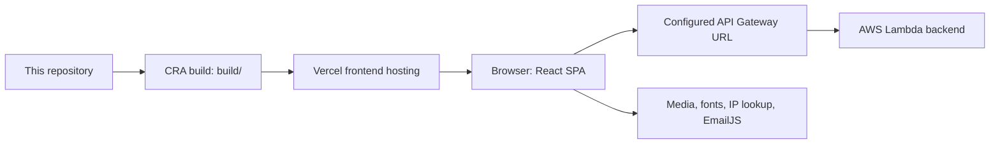

# Deployment and operations

This is the deployment reference for agents. **The maintainer confirms Vercel hosts the frontend and AWS Lambda hosts the backend.** The frontend source demonstrates an API Gateway endpoint; the Gateway-to-Lambda integration and cloud account settings are outside this repository. Do not infer that this is a Next.js app or that Lambda is deployed by the frontend build.

## Confirmed deployment boundary

The diagram describes the confirmed high-level services; it does not specify AWS integration mode, database, IAM roles, or a verified release pipeline. The browser calls the API directly. There is no frontend API proxy, local backend, Vercel Function, or Lambda deployment script in this checkout.

## External configuration inventory

| Setting | Known value or evidence | What an agent must establish for deployment work |
| --- | --- | --- |
| Frontend host | Vercel, maintainer-confirmed | Team/project identity and permitted deployment scope |
| Public domain used by copy links | `https://valorant-lineups.com` in [ContentFrame.tsx](../src/component-utils/lineup-site-utils/ContentFrame.tsx) | Vercel domain association, DNS owner and aliases |
| Git integration / production branch | Not specified in this repository | Actual linked repository, branch tracking and auto-deploy settings |
| Build configuration | CRA scripts in [package.json](../package.json) | Actual Vercel overrides, root directory and Node version |
| Backend runtime | AWS Lambda, maintainer-confirmed | Backend source repository, function name/ARN, version/alias, runtime and release process |
| Client API URL | [constants.ts](../src/component-utils/constants.ts): `https://uh5it8zn19.execute-api.us-east-1.amazonaws.com/development` | Gateway integration, stage semantics, authorization and CORS configuration |
| Database/media storage | Not defined here | Data store, backup/restore owner, image-host ownership and upload process |
| Mutation API keys | Runtime form input | Provisioning, rotation, revocation, permissions and usage plans |
| EmailJS | Client identifiers in [EmailForm.tsx](../src/component-utils/lineup-site-utils/EmailForm.tsx) | Account owner, template/destination, origin restrictions, limits and retention |
| CI and release automation | No checked-in workflow or deploy command | Any externally configured checks/hooks and required release gates |
| Observability | UI error messages and console output in source | Cloud logs, dashboards, alerts, retention and incident contacts |

The `/development` URL suffix is a stage name, not proof of a non-production database. None of the unknowns above should be filled by guessing common Vercel/AWS defaults.

## Build contract

The following values are derived from this repository and are compatible targets for the hosting configuration. They are **not an export of the existing Vercel project settings**.

| Item | Repository requirement |
| --- | --- |
| Application root | Directory containing `package.json` |
| Framework | Create React App / static React SPA |
| Install | `yarn install --frozen-lockfile`, using the pinned Yarn 1.22.22 |
| Verification | `yarn verify` or `npm run verify` before release |
| Production build | `yarn build` (includes the Sass `prebuild` hook) |
| Output directory | `build`, not `dist` |
| Local reference runtime | Node.js 22.13.1; no repository `engines` or `.nvmrc` pin |
| URL base | `/`; no Router basename or package homepage configured |
| JavaScript source maps | Disabled by `GENERATE_SOURCEMAP=false` in the build script |
| Client environment settings | No application-specific environment-variable reads; API/domain/feedback settings are compiled from source |

Install development dependencies for builds because TypeScript, Sass, types and test tools are needed. `build/` is ignored by Git; generated `src/css/main.min.css` and its Sass source map are tracked. Do not copy `src/`, `node_modules/`, or credentials into the static deployment artifact.

Vercel supports CRA and Git-based previews; the current project can remain a static CRA deployment. Hosting on Vercel does not imply use of Next.js, Vercel Functions, Analytics, or Speed Insights. This repository does not import Vercel analytics packages. [Vercel CRA documentation](https://vercel.com/docs/frameworks/frontend/create-react-app)

## Frontend routing

[App.tsx](../src/App.tsx) uses `BrowserRouter`. A direct request to `/about`, `/send`, `/select`, `/edit`, or a lineup ID must receive the SPA HTML so React can select the route. Checking only `/` does not verify this requirement.

Inspect existing framework routing and project settings before adding a catch-all rewrite. Vercel documents rewrites in project configuration; they change internal request routing while retaining the requested URL. Preserve actual static-file delivery and any separately configured endpoints when adapting them. No `vercel.json` is currently checked in. [Vercel rewrite reference](https://vercel.com/docs/routing/rewrites)

Verify after a routing change:

- Known routes return the HTML entry point on a fresh request and browser refresh.
- JavaScript/CSS/image URLs return their own files with appropriate content types, not fallback HTML.
- A real direct lineup link selects the correct record; an unknown ID remains usable.
- Browser back/forward works after selecting a marker.
- A subdirectory deployment is not assumed to work: root-relative routes, assets, and editor links would need a coordinated change.

The source has no catch-all React 404 component. A single unknown path segment matches `/:lineupId`; unrelated multi-segment paths do not match a page. Do not document a custom 404 behavior that is not implemented.

## API connectivity and CORS

The request contract is in [API_REFERENCE.md](API_REFERENCE.md). The client sends JSON content-type headers for GET and POST; maintainer POSTs also send `x-api-key` and `request-type`. Cross-origin requests can therefore require preflight. Check the browser's OPTIONS request as well as the actual request, allowed origins, methods, headers, and error responses.

For API Gateway REST APIs, CORS behavior depends on the integration; proxy integrations can require the backend to return the appropriate response headers. Do not assume that changing frontend code can repair an AWS preflight failure, or that a Lambda function-URL CORS setting applies to this API Gateway URL. [AWS API Gateway CORS documentation](https://docs.aws.amazon.com/apigateway/latest/developerguide/how-to-cors.html)

Localhost, `127.0.0.1`, a preview domain, and the production domain are different browser origins. A successful command-line GET does not prove browser CORS works. The frontend does not supply a mock server or environment-specific API switch; a Vercel preview normally uses the same compiled URL and production copy-link domain as any other build of this source.

## Release procedure

This is a procedure for an authorized release task, not a claim that these gates are automated today.

1. Establish the target Vercel project/environment, branch/deployment mechanism and source commit from the external inventory. A frontend release does not deploy Lambda.
2. Inspect the working tree; include intended source, tests, generated CSS and lockfile changes together. Do not publish unrelated local work.
3. Run a frozen install and the full [verification gate](TESTING.md). Review any dependency audit findings relevant to the change.
4. Compare the client data contract and catalogs against the backend's supported data. Deploy compatible client catalog support before introducing records that depend on new IDs.
5. Use the project's existing preview/release mechanism and inspect its build logs. Vercel Git integrations distinguish the configured production branch from preview branches; the actual branch is project configuration. [Vercel Git deployments](https://vercel.com/docs/git)
6. Verify direct routes, assets, API/CORS, map data, media, and key interactions on the target deployment. Exercise mutations only within the task's explicitly identified data scope; normal frontend release verification uses mocks/read-only checks.
7. Record the deployed commit/URL, checks, known limits, and rollback target. Publish or promote only within the user's requested release scope.

The build command does not run the complete Jest suite by itself. If Vercel only runs `yarn build`, separate test/typecheck/lint verification still needs to be arranged; no CI workflow in this repository supplies it automatically.

## Cache behavior during releases

There are independent caches: hosted static assets/browser HTTP caching, and the application's ten-day local-storage record cache. Redeploying the frontend does not automatically erase `savedLineups` on users' devices. Successful maintainer mutations invalidate the cache in that browser origin for a future load; already-mounted pages retain their in-memory data. Other browsers/origins are not actively notified.

A schema migration must consider cached old records. The current cache has no explicit schema-version key: it refreshes on expiry or runtime-validation failure. Do not change the meaning of stable IDs or coordinates and assume a frontend deployment will repair old data.

## Rollback and incident diagnosis

- **Frontend regression:** identify a previously verified Vercel deployment/commit and use the project's release process to restore it. Verify direct links and asset consistency afterward. This does not undo remote lineup mutations.
- **Bad lineup edit/delete:** use the backend's actual backup/history/recovery process. The frontend has no undo or restore endpoint, and the historical checked-in snapshot is not a current backup.
- **API failure:** capture time, frontend origin, method, status and a redacted request identifier/body. Separate preflight, Gateway rejection, Lambda failure and record-schema mismatch before choosing a fix.
- **Build failure:** inspect the earliest compiler/lint/module error and compare Node/Yarn/lockfile versions. Do not change unrelated code to compensate for an unconfirmed hosting setting.

AWS documents Lambda logging to CloudWatch, subject to the function's logging configuration and permissions. Inspect the actual function's configured log destination; this repository cannot supply a function name, log group, retention period, or proof that logging is enabled. [Lambda logging reference](https://docs.aws.amazon.com/lambda/latest/dg/monitoring-cloudwatchlogs.html)

See [TROUBLESHOOTING.md](TROUBLESHOOTING.md) for symptom-specific investigation and [SECURITY.md](SECURITY.md) before copying logs or handling keys.
