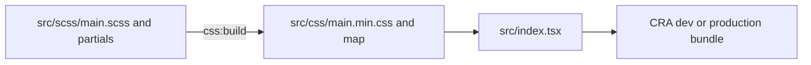

# Development guide for agents

Use this guide to locate implementation points, make bounded changes, and reproduce the local toolchain. Start with [AGENTS.md](../AGENTS.md). Architectural invariants are in [ARCHITECTURE.md](ARCHITECTURE.md); test selection and real-browser checks are in [TESTING.md](TESTING.md). Public behavior belongs in [USER_GUIDE.md](USER_GUIDE.md), and content-authoring procedures belong in [MAINTAINER_GUIDE.md](MAINTAINER_GUIDE.md).

## Establish the workspace before editing

Run from the directory containing [`package.json`](../package.json):

```sh
git status --short
node --version
corepack yarn --version
rg --files src docs
```

Preserve unrelated changes already in the working tree. Do not regenerate assets, renumber catalogs, or refresh the dependency graph as a side effect of an unrelated edit. The repository may contain generated `build/`, `coverage/`, and `node_modules/` directories; none is application source.

Use **Node.js 24.x** with **Yarn Classic 1.22.22**. [`package.json`](../package.json) requires Node 24 through `engines.node` and pins Yarn through `packageManager`; [`yarn.lock`](../yarn.lock) records dependency resolution. The verified local runtime is Node.js 24.21.0. There is no checked-in `.nvmrc` or `.node-version`. See [Deployment](DEPLOYMENT.md#build-contract) for how the Node requirement selects Vercel's build runtime.

### Install and run

With Corepack available:

```sh
corepack yarn install --frozen-lockfile
corepack yarn start
```

Open `http://localhost:3000` after the development server reports readiness. The default port is Create React App's port; follow the server output if another port is used. A direct `yarn` command is equivalent only when it resolves to the expected Yarn version. `corepack yarn` avoids depending on a globally installed Yarn executable or an enabled Yarn shim.

In PowerShell, use executable shims explicitly if a script execution policy intercepts `npm.ps1`/`corepack.ps1`:

```powershell
node --version
corepack.cmd yarn --version
corepack.cmd yarn install --frozen-lockfile
npm.cmd run start
```

`npm.cmd run ...` is supported for **running scripts after the Yarn install**. It is not a request to switch installers or generate `package-lock.json`. The project maintains one Yarn lockfile, and its `resolutions` are important to the installed graph. An npm install/ci workflow is not the reproducible installation procedure documented here.

Corepack must already be available on the machine for these commands to work. If it is absent or registry access fails, use [TROUBLESHOOTING.md](TROUBLESHOOTING.md); do not silently replace the lockfile or use an arbitrary Yarn major version. A frozen install should not rewrite `package.json` or `yarn.lock`.

### Runtime configuration boundary

No application module currently reads an environment variable. No `.env` file, local backend process, database, or credentials are needed to render the frontend. Data and media still come from external services:

| Runtime value | Edit location |
| --- | --- |
| API Gateway base URL and ten-day cache interval | [`src/component-utils/constants.ts`](../src/component-utils/constants.ts) |
| Production domain used by copy-link | [`ContentFrame.tsx`](../src/component-utils/lineup-site-utils/ContentFrame.tsx) |
| Feedback EmailJS identifiers and IP lookup URL | [`EmailForm.tsx`](../src/component-utils/lineup-site-utils/EmailForm.tsx) |
| Map/agent/tag catalog and local image imports | [`constants.ts`](../src/component-utils/constants.ts) |
| Screenshot URLs, video IDs, creator credits | Backend lineup records; see [LINEUP_DATA.md](LINEUP_DATA.md) |

The frontend is hosted on Vercel and the backend on AWS Lambda, as confirmed by the user. This checkout does not contain their project/function settings or infrastructure definitions. See [DEPLOYMENT.md](DEPLOYMENT.md) for deployment boundaries and unknown configuration.

Loading real lineups is a read operation. The maintainer submit controls and feedback form send real external requests when used with live configuration. For implementation tests, the existing suites inject or mock these boundaries; see [TESTING.md](TESTING.md).

## Command reference

All commands below run from the repository root. Replace `npm` with `npm.cmd` in PowerShell when needed. Alternatively, use `corepack yarn <script>`; arguments pass directly after the script name rather than requiring npm's `--` separator.

| Command | Behavior / outputs |
| --- | --- |
| `npm run start` | Runs `prestart` to compile Sass, then starts CRA development mode. |
| `npm run css:build` | Compiles `src/scss/main.scss` into checked-in `src/css/main.min.css` and its source map. |
| `npm run typecheck` | Runs `tsc --noEmit` over `src`, including tests and declarations. |
| `npm run lint` | ESLint over `.ts` and `.tsx`; any warning fails the command. |
| `npm test` | Jest/React Testing Library once, `--watchAll=false --runInBand`. |
| `npm run test:watch` | Interactive CRA/Jest watch mode. |
| `npm run test:coverage` | One test run with coverage output under ignored `coverage/`. |
| `npm run build` | Runs `prebuild` to compile Sass, then creates ignored `build/`; JavaScript source maps are disabled via `cross-env GENERATE_SOURCEMAP=false`. |
| `npm run verify` | Sequentially runs typecheck, lint, tests, and production build. Stops when a command fails. |
| `npm run eject` | CRA's eject operation; changes build ownership and is not part of normal development or verification. |

Focused test example:

```powershell
npm.cmd test -- --runTestsByPath src/component-utils/responsive-pinch-zoom-pan/PinchZoomPan.test.tsx
```

Equivalent Yarn invocation:

```sh
corepack yarn test --runTestsByPath src/component-utils/responsive-pinch-zoom-pan/PinchZoomPan.test.tsx
```

Do not invoke `react-scripts`, `tsc`, or `eslint` as presumed global commands. Package scripts put the installed binaries on PATH. The aggregate script uses `npm run` internally so it works whether initially invoked by npm or Yarn.

`prestart` and `prebuild` are package-manager lifecycle hooks. Running `node node_modules/react-scripts/bin/react-scripts.js build` directly bypasses them and can build stale CSS. Use the package scripts unless deliberately isolating a diagnosed tool issue.

## Task-to-source map

Use exact symbols to narrow a change before reading entire pages.

| Task | Start here | Check related callers |
| --- | --- | --- |
| Add/change a route or top-level page | [`App.tsx`](../src/App.tsx), `App` | [`Navbar`](../src/component-utils/navbar/Navbar.tsx), [`SidebarData`](../src/component-utils/navbar/SidebarData.tsx), route tests. |
| Fix direct-link/history behavior | [`LineupSite.tsx`](../src/pages/LineupSite.tsx), `syncSelectionWithUrl`, `componentDidUpdate`, `updateActiveMarker` | [`withRouter`](../src/component-utils/withRouter.tsx), [`App.test.tsx`](../src/App.test.tsx). |
| Fix cache, storage, or API-response handling | [`lineup-data.ts`](../src/services/lineup-data.ts), `loadLineups`, `parseLineupCache`, storage helpers | Viewer and selector mount methods. |
| Change filtering or marker grouping | `filterLineups`, `clusterLineups`, `arrowsForCluster` in `lineup-data.ts` | `updateMap` and marker events in both viewer and selector. |
| Change marker visuals or map transforms | [`map-utils`](../src/component-utils/map-utils/MapInteractionCSS.tsx), `Marker`, `StartMarker`, `Map` | Viewer/selector SVG layers and [`_map.scss`](../src/scss/lineupSite/_map.scss). |
| Change screenshot zoom | [`PinchZoomPan`](../src/component-utils/responsive-pinch-zoom-pan/PinchZoomPan.tsx), [`Utils`](../src/component-utils/responsive-pinch-zoom-pan/Utils.ts) | [`ImageFrame`](../src/component-utils/lineup-site-utils/ImageFrame.tsx), native event/StrictMode tests. |
| Change detail/media/copy/hiding behavior | [`ContentFrame`](../src/component-utils/lineup-site-utils/ContentFrame.tsx), `TagList`, `ImageFrame`, `YoutubeEmbed` | Viewer `updateLineupState` and hidden-marker helpers. |
| Change feedback | [`EmailForm`](../src/component-utils/lineup-site-utils/EmailForm.tsx) | Form mount/cleanup and mocked EmailJS tests; external configuration. |
| Change shared form inputs | [`BaseForm`](../src/component-utils/design-utils/BaseForm.tsx), `handleImageAdd`, `handleImageDelete` | `DesignForm`, `EditForm`, `LineupFormValues`. |
| Change create/edit/delete behavior | [`lineup-admin.ts`](../src/services/lineup-admin.ts) | `DesignLineup.onSubmit/sendLineupToDB`, `EditLineup.onSubmit/sendUpdateToDB/saveSelection`. |
| Add a map, agent, ability, or tag | [`constants.ts`](../src/component-utils/constants.ts) | [LINEUP_DATA.md](LINEUP_DATA.md), relevant assets and tag styles. |
| Change browser page metadata | [`public/index.html`](../public/index.html), [`public/manifest.json`](../public/manifest.json) | Page `document.title` assignments and public assets. |

A useful initial search pattern is:

```sh
rg -n 'symbolName|relatedProp' src docs
```

The sample record builder is [`src/test-utils/lineup-fixtures.ts`](../src/test-utils/lineup-fixtures.ts). Files under [`src/resources/Lineups`](../src/resources/Lineups/lineups.json) and [`sampleLineup.json`](../src/resources/sampleLineup.json) are historical artifacts, not a development seed or active API fallback.

## TypeScript boundaries and patterns

The application and tests are `.ts`/`.tsx`. [`tsconfig.json`](../tsconfig.json) uses `strict`, `noUnusedLocals`, `noUnusedParameters`, `noFallthroughCasesInSwitch`, `forceConsistentCasingInFileNames`, and `allowJs:false`. It also enables `isolatedModules`, `resolveJsonModule`, ES module interop, and the automatic `react-jsx` transform. `noEmit:true` means the compiler validates; CRA/Babel handles the build transform.

`target: "es5"` is not a guarantee of legacy-browser support. The code uses modern browser APIs and the build has its own Browserslist targets. `lib` includes DOM and modern ECMAScript declarations. `skipLibCheck:true` skips declaration-file body checking; it does not make incorrectly used imported types harmless. `noUncheckedIndexedAccess` is not enabled, so array/catalog lookups still need explicit guards where a value may be missing.

### Shared data versus UI state

Reuse [`types/lineup.ts`](../src/types/lineup.ts):

- `LineupRecord`: persisted/network shape with numeric IDs and plain URL strings.
- `LineupFormValues`: select option objects, image tags, draft fields, API key, and status.
- `LineupsByMap` and `ABILITY_LIST`: partial numeric records. Missing entries are expected, so use `?? []` or an explicit guard.
- `LineupCluster`, `ClusterPoint`, `MapArrow`, and `MapTransform`: shared map data.
- `SelectOption` and its map/agent/ability/tag variants: select-control shapes. `AbilityOption.icon` is optional; `MapOption.icon` is required.

Parse untrusted data as `unknown` and narrow through guards such as `isLineupRecord`/`isLineupArray`. A cast to `LineupRecord` is not a replacement for checking JSON. Catalog helpers can return `undefined`; select handlers use `SingleValue<T>`, which can be `null`.

For controlled fields, retain the typed update callback pattern:

```ts
type UpdateDraft = (
  values: Partial<LineupFormValues>,
  callback?: () => void
) => void;
```

For `react-select`, supply the option and multi-select generic deliberately, such as `Select<MapOption, false>` or `StylesConfig<AgentOption, false>`. A generic arrow function in `.tsx` can need a trailing comma (`<Option extends SelectOption,>`) to disambiguate it from JSX. Existing page style factories demonstrate this pattern.

Mutation calls use correlated tuple types in `lineup-admin.ts`. Preserve that relationship when adding an operation or payload field; use the builders and update the corresponding runtime validation and request tests. See [API_REFERENCE.md](API_REFERENCE.md) for the public helper signatures.

### Ambient declarations and imports

[`src/react-app-env.d.ts`](../src/react-app-env.d.ts) references `react-scripts` types, including the standard imported asset/CSS declarations. A separate custom PNG wildcard declaration is unnecessary. [`src/types/react-map-interaction.d.ts`](../src/types/react-map-interaction.d.ts) describes the map library's subset used by the app. If a new library prop is needed, confirm its runtime behavior in the installed package before adding its type here.

Use `import type` or inline `type` specifiers for type-only dependencies. The automatic JSX transform means a default `React` import is unnecessary for JSX alone. A class extending `React.Component` or code using `React.Children` still requires the runtime import. Keep component props and state explicit; keep small internal types next to their implementation and reusable domain types in `types/lineup.ts`.

## Styling: source, generated files, and selector coupling

The main path is:



Edit Sass, then run `npm run css:build`. The generated CSS and `.map` are checked in and should accompany source changes. `prestart`/`prebuild` refresh them automatically at startup/build time. There is no `css:watch` package script, and the app imports the generated CSS rather than `.scss`; editing a partial during an already-running dev server requires another compile before the browser can show the change.

The pinch/zoom controls have a separate directly imported [`responsive-pinch-zoom-pan/styles.css`](../src/component-utils/responsive-pinch-zoom-pan/styles.css). Popup and toast library CSS are imported by `ContentFrame`. Those files are separate from the Sass compilation path.

| Source / selectors | Coupled behavior |
| --- | --- |
| [`_utils.scss`](../src/scss/_utils.scss): `$lineup-site-map-width`, `outer-frame`, shared mixins | Viewer map/content split and full-viewport layouts. |
| [`lineupSite/_map.scss`](../src/scss/lineupSite/_map.scss): `#lineup-site-map`, `.fixed-marker-frame`, `.marker-icon` | 1000-pixel map overlays, 25-pixel markers, rotation alignment. |
| [`lineupSite/_content.scss`](../src/scss/lineupSite/_content.scss): `#content-frame`, `.image-frame`, `.lineup-image`, `#video-frame` | Content owns vertical scrolling; media frames have explicit viewport-relative heights. |
| [`designSite/_map.scss`](../src/scss/designSite/_map.scss): `.design-map-frame`, `.map-and-buttons`, `.map-select-point` | Maintainer map placement and map/form column layout. |
| [`designSite/form/_form.scss`](../src/scss/designSite/form/_form.scss): `.row`, `.design-label`, `.description`, status classes | Shared create/edit fields and messages. |
| [`lineupSite/_tags.scss`](../src/scss/lineupSite/_tags.scss): `.tag.<labelWithoutWhitespace>` | `TagList` constructs this class from the label, not the numeric tag ID. |
| [`navbar/_navbar.scss`](../src/scss/navbar/_navbar.scss): `.nav-menu.active`, `.menu-bars` | Slide-out navigation transitions and reset styles for native buttons. |
| [`main.scss`](../src/scss/main.scss): `body`, `span`, button and heading rules | Global reset, hidden body overflow, fonts, and inherited styling. |

There are no CSS modules. Renaming a class/ID requires searching both JSX and Sass. Generic selectors such as `span`, `.row`, `.error`, and `.info` can affect several screens; both navbar and main Sass contain global `span` rules, so import/cascade order matters. Inline transforms in map/media components intentionally own geometry and should not be overridden accidentally by a new selector.

Changing the marker size requires reviewing the authoring `12.5` click offset, service/page `13` arrow offset, fixed overlay dimensions, CSS, and regressions together. Changing a tag label can change its CSS class even if its persistent ID stays the same. Changing container dimensions must preserve image measurement triggers; the local pinch component has no `ResizeObserver`.

For every layout edit, inspect the affected route in a browser and run the relevant geometry/interaction checks in [TESTING.md](TESTING.md). A production build catches import/minification errors but cannot prove overlay alignment.

## Assets and catalogs

Local map and ability images live under [`src/resources`](../src/resources/Maps/ascent_map.png) and are imported as modules in `constants.ts`. CRA emits their bundle URLs; keep exact filename casing for case-sensitive builds. Files in [`public`](../public/index.html) bypass the module import path and are copied for hosting; use that location for assets that genuinely need a public fixed path.

A typical local asset addition is:

```ts
import NewIcon from "../resources/Agents/ChosenAgent/New_Icon.png";
```

Wire it into the appropriate typed option. Do not rename or renumber existing IDs to make the array look sorted. An ability without an icon is supported and uses the generic X marker; an unknown agent/ability may be excluded by page marker rendering. New minimaps must match the 1000 × 1000 geometry contract. Follow the ID tables and extension procedure in [LINEUP_DATA.md](LINEUP_DATA.md), including documentation updates.

Lineup screenshots are remote URLs stored in records, not uploaded by these forms. `BaseForm` splits comma-separated image input, trims values, ignores empties/duplicates, and creates `ImageTag` objects. The payload builder converts them back to strings. Do not assume image input verifies HTTP status or that adding a file under `resources` automatically creates a lineup.

## Dependency ownership and pins

[`package.json`](../package.json) and [`yarn.lock`](../yarn.lock) must be considered together. A caret range in the manifest does not identify the exact installed release; inspect the lockfile when evaluating compatibility. Runtime dependencies retained for a library's peer/import requirements are not necessarily unused just because application source does not import them directly.

| Dependency group | Purpose and constraint |
| --- | --- |
| React/React DOM `18.2.0` | Application runtime, `createRoot`, StrictMode. Keep runtime and declaration versions compatible. |
| TypeScript `4.9.5`, CRA `5.0.1` | Current compilation/build/test stack. A major toolchain change is a separate migration, not an incidental package refresh. |
| `react-router-dom` v6 range | `BrowserRouter`, declarative routes, hook-based navigation/params. |
| `react-map-interaction` v2 range | Map gesture state; app-local `.d.ts` covers only used props. |
| `reselect` `4.1.7`, `warning` `4.0.3` | Local pinch/zoom selectors and configuration diagnostics. |
| `react-select`, `react-multi-select-component` | Controlled map/agent/ability/tag inputs with library-specific prop typing. |
| `react-tag-input` `6.8.1`, React DnD `14.0.5`, HTML5 backend `14.1.0` | Image URL tag control and its compatible dependency line; app disables drag/drop in this control. |
| `prop-types` | Runtime library/peer requirement, including the map library; app's own contracts use TypeScript. |
| `react-icons` | Shared icon collection, including navigation and zoom controls. |
| `reactjs-popup`, `react-toastify`, `emailjs-com` | Feedback popup, status toasts, and external feedback send. |
| Sass `1.77.8`, `cross-env` v7 range | CSS generation and portable build-time environment setting. |
| Pinned Testing Library/Jest/React declaration packages | Compatibility with the CRA/Jest/React stack; see [TESTING.md](TESTING.md). |

Manifest `resolutions` currently keep React types at `18.0.28`/`18.0.11`, pin `nwsapi` to `2.2.2`, and select patched Lodash/Underscore ranges. The selector-engine pin preserves working jsdom selector behavior documented in [REVIEW.md](REVIEW.md). Do not remove these overrides without reproducing and rechecking the affected integrations.

For a dependency change:

1. Identify the direct package, consumer/peer requirements, and any relevant resolution.
2. Use the pinned Yarn to make the manifest/lockfile change deliberately.
3. Verify that a subsequent frozen-lockfile install succeeds.
4. Run `npm run verify` and the affected browser interactions; inspect dependency/audit changes using [SECURITY.md](SECURITY.md).
5. Record intentional version/pin changes and remaining issues in the appropriate documentation. A lockfile refresh is not evidence that the app has no security findings.

## Bounded change recipes

### Add or change a route

1. Add the typed page under `src/pages` and register it in `App.tsx`.
2. Add a `SidebarData` entry only if the route belongs in public navigation; existing maintainer routes are deliberately absent.
3. Check collisions with `/:lineupId`. Set the page title where other pages set it on mount.
4. If a class needs router hooks, use the existing typed `withRouter` pattern; functional pages can use hooks directly.
5. Update route integration tests, [ARCHITECTURE.md](ARCHITECTURE.md), the relevant user/maintainer guide, and deployment rewrite expectations. A client route must also work after a direct URL load on the host.

### Change data logic or a form field

1. Choose the shared type and source module using the task map above.
2. Update the runtime boundary and conversion, not only the TypeScript interface.
3. Update all shared callers: viewer/selector for read logic; create/edit for form logic.
4. Preserve immutable arrays, API-key runtime handling, submission locks, and failure-draft behavior.
5. Add a regression for the externally visible behavior and update [LINEUP_DATA.md](LINEUP_DATA.md), [API_REFERENCE.md](API_REFERENCE.md), or [MAINTAINER_GUIDE.md](MAINTAINER_GUIDE.md) as appropriate.

### Change a component or browser effect

1. Keep props typed; place cross-page behavior in a shared component/service rather than copying it into a page.
2. Handle null/undefined selections and absent data before rendering dependent controls.
3. Pair native listener/timer/request setup with cleanup. Account for StrictMode setup-cleanup-setup and obsolete async completion.
4. Preserve accessible names, keyboard activation, and status feedback. Existing map marker controls still have limitations; do not claim complete accessibility based only on button improvements.
5. Run focused behavior tests, then the required full gate and real-browser checks in [TESTING.md](TESTING.md).

### Change styles or assets

1. Search class/ID and asset references before renaming or moving anything.
2. Edit the Sass source or the explicitly independent zoom-control stylesheet.
3. For catalogs, keep permanent IDs and coordinate dimensions stable; follow [LINEUP_DATA.md](LINEUP_DATA.md).
4. Rebuild Sass when relevant and include both generated outputs.
5. Inspect layout, zoom/rotation alignment, and the production bundle; update the feature/data documentation if behavior or catalog support changes.

## Documentation that changes with implementation

Use relative Markdown links to repository files. Link the code or helper name that establishes a behavior instead of copying long source listings. Separate a code-derived fact, a user-confirmed hosting fact, and an unknown external setting; do not turn an assumption into a configuration instruction.

| Implementation change | Documentation to revisit |
| --- | --- |
| Commands, dependencies, TypeScript, style pipeline | This guide, [CONTRIBUTING.md](../CONTRIBUTING.md), [AGENTS.md](../AGENTS.md) |
| Routes, lifecycle/state, algorithms, transforms | [ARCHITECTURE.md](ARCHITECTURE.md) and relevant guides |
| Catalog IDs, record/cache shape | [LINEUP_DATA.md](LINEUP_DATA.md) |
| Requests, payload builders, validation contract | [API_REFERENCE.md](API_REFERENCE.md) |
| User controls or maintainer procedure | [USER_GUIDE.md](USER_GUIDE.md), [MAINTAINER_GUIDE.md](MAINTAINER_GUIDE.md) |
| Test setup, regression scope, verification commands | [TESTING.md](TESTING.md) |
| External configuration, deployment, credential/data handling | [DEPLOYMENT.md](DEPLOYMENT.md), [SECURITY.md](SECURITY.md) |
| Failure symptom and diagnosed remedy | [TROUBLESHOOTING.md](TROUBLESHOOTING.md) |

Keep [docs/README.md](README.md) and the agent entrypoint current when adding or relocating documents. Historical review counts are dated evidence in [REVIEW.md](REVIEW.md), not permanent assertions to duplicate across every guide. For documentation-only work, verify links, commands, and claims against source; do not perform live writes or rebuild application assets merely to edit prose.
